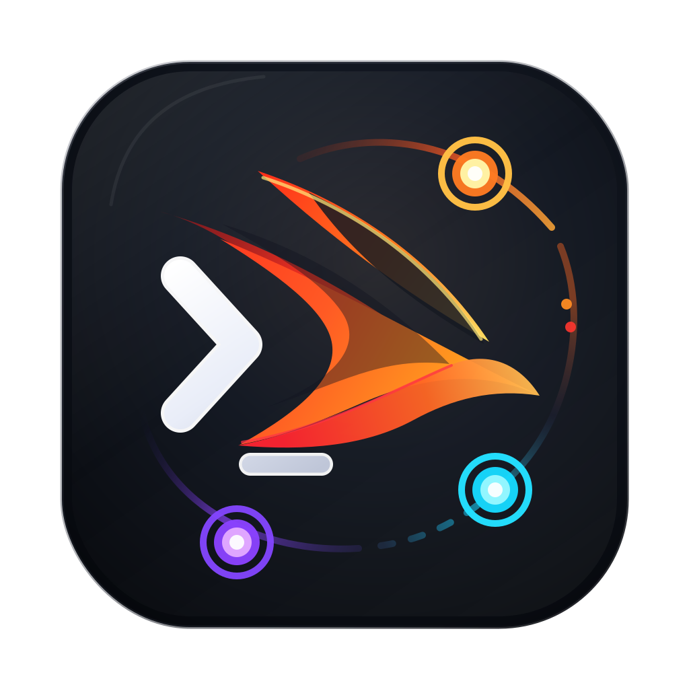

<p align="center">
  
</p>

<h1 align="center">Build Swift Apps</h1>

<p align="center">
  Agent skills for building, debugging, profiling, testing, refactoring, and shipping Swift apps across Apple platforms.
</p>

<p align="center">
  <b>Codex</b> · <b>Claude Code</b> · <b>Cursor</b> · <b>pi</b> · <b>Manual skill installs</b>
</p>

Build Swift Apps is a multi-agent skill pack for practical Apple-platform
development. It focuses on the workflows that usually decide whether an AI
coding session is useful in a real Swift repository: building the app, running
it on a simulator, understanding failures, improving SwiftUI and AppKit code,
profiling performance, auditing Xcode build times, and preparing apps for
release.

The deepest coverage is for iOS and macOS, but the skills are written for
Apple-platform Swift work in general. They are intentionally generic: no
company-specific project names, no private workflows, and no assumptions about
one app architecture.

## Quick Start

### Easiest: Ask Your Agent

For most users, the simplest install path is to paste this prompt into the
coding agent they already use:

```text
Install the Build Swift Apps plugin from https://github.com/Xopoko/build-swift-apps on this computer. Follow the repository installation instructions for the agent you are running in, install required dependencies, ask before installing optional tools, run the doctor checks, and report what was installed.
```

### Codex

```bash
mkdir -p "$HOME/.agents/plugins/plugins"
git clone https://github.com/Xopoko/build-swift-apps.git \
  "$HOME/.agents/plugins/plugins/build-swift-apps"
cd "$HOME/.agents/plugins/plugins/build-swift-apps"

./scripts/install-local-plugin.sh
./scripts/doctor.sh --profile core --profile mcp
```

Then start a new Codex thread and ask for a focused workflow:

> Use the iOS debugger skill to build and run this app on a simulator, inspect the first screen, and summarize any runtime failures.

### Claude Code

This repository includes Claude Code plugin metadata under `.claude-plugin/`.
After the repository is public or accessible to your GitHub account:

```text
/plugin marketplace add Xopoko/build-swift-apps
/plugin install build-swift-apps@build-swift-apps
/reload-plugins
```

If you use the `appstore-screenshot-studio` skill in Claude Code, install its local Node helper
dependency after the plugin is installed:

```bash
cd "$HOME/.claude/plugins/marketplaces/build-swift-apps"
./scripts/install-deps.sh --profile screenshots --yes
```

Claude Code namespaces plugin skills, so invoke them as
`/build-swift-apps:<skill-name>` when calling skills explicitly.

### Cursor

This repository includes Cursor plugin metadata under `.cursor-plugin/`.
Use Cursor's plugin install or local testing flow once the repository is
available to your Cursor workspace. The same `skills/` directory is packaged for
Cursor, and `AGENTS.md` provides repository-level guidance for agents that read
the open instruction format.

### Dependency Check

The skills can run with partial dependencies. Check the current machine first:

```bash
./scripts/doctor.sh --all
```

Install only the tool groups you need:

```bash
./scripts/install-deps.sh --profile core --profile mcp
./scripts/install-deps.sh --profile tuist --profile performance --dry-run
./scripts/install-deps.sh --all --skip ettrace --skip ipsw
```

See [docs/INSTALL.md](docs/INSTALL.md) for full install instructions,
dependency profiles, and manual setup notes.

## Included Skills

The skill IDs follow a deliberate naming system:

- `appstore-*` for App Store Connect, TestFlight, screenshots, metadata, pricing, and release operations.
- `ios-*` and `macos-*` for platform-specific runtime, UI, packaging, and debugging work.
- `swiftui-*`, `xcode-*`, `swiftpm-*`, `tuist-*`, and `apple-*` for framework, build, package, project-generation, and research workflows.
- Role nouns describe the agent's posture: `architect`, `inspector`, `strategist`, `tuner`, `director`, `studio`, `operator`, `coordinator`, and `runner`.

### Build, Run, Debug, And Test

| Skill | Purpose |
| --- | --- |
| `macos-runtime-debugger` | Build, launch, log, and debug local macOS apps and desktop executables. |
| `macos-swiftpm-runner` | Build, run, and test SwiftPM-first macOS packages and command-line tools. |
| `macos-test-diagnoser` | Triage failing Xcode or SwiftPM test runs and separate real regressions from setup issues. |
| `xcode-ui-test-stabilizer` | Create, stabilize, and run Xcode UI tests with focused failure evidence. |
| `macos-telemetry-probe` | Add lightweight `Logger` instrumentation and verify events through runtime logs. |

### iOS Simulator, Profiling, And Runtime Evidence

| Skill | Purpose |
| --- | --- |
| `ios-simulator-debugger` | Use XcodeBuildMCP to build, run, inspect, and debug iOS simulator apps. |
| `ios-rocketsim-operator` | Use RocketSim's bundled agent skill and CLI for visible simulator UI interaction. |
| `ios-ettrace-profiler` | Capture and interpret symbolicated ETTrace profiles for iOS simulator flows. |
| `ios-memgraph-inspector` | Capture, inspect, and compare simulator memory graphs with `leaks` evidence. |
| `swiftui-performance-inspector` | Audit SwiftUI performance from code structure before asking for profiling evidence. |

### SwiftUI, AppKit, And Product UI

| Skill | Purpose |
| --- | --- |
| `ios-swiftui-architect` | Build iOS SwiftUI screens with navigation, layout, state, forms, sheets, and media patterns. |
| `macos-swiftui-architect` | Build macOS SwiftUI scenes, commands, toolbars, settings, split views, and menu bar extras. |
| `swiftui-view-architect` | Refactor SwiftUI views into stable, testable, dependency-explicit components. |
| `macos-view-architect` | Refactor macOS SwiftUI scenes and sidebar/detail structures. |
| `macos-appkit-bridge` | Bridge SwiftUI to AppKit only where native macOS behavior needs it. |
| `macos-window-architect` | Tune macOS 15+ SwiftUI windows, placement, restoration, and scene behavior. |
| `ios-intents-architect` | Design App Intents, entities, queries, and shortcuts for Siri, Spotlight, widgets, and controls. |
| `macos-liquid-glass-designer` | Adopt modern macOS SwiftUI design and Liquid Glass conventions. |
| `ios-liquid-glass-designer` | Implement and review iOS 26+ Liquid Glass SwiftUI features. |

### Xcode Build Performance

| Skill | Purpose |
| --- | --- |
| `xcode-build-strategist` | End-to-end recommend-first build optimization: benchmark, analyze, prioritize, approve, fix, verify. |
| `xcode-build-baseline` | Produce repeatable clean and incremental Xcode build baselines with artifacts. |
| `xcode-compile-profiler` | Find Swift compile and type-checking hotspots with compiler diagnostics. |
| `xcode-project-auditor` | Audit build settings, schemes, target dependencies, and script phases. |
| `swiftpm-build-inspector` | Analyze Swift Package Manager graph shape, plugins, pins, and module variants. |
| `xcode-build-tuner` | Apply approved build optimizations and re-benchmark to prove impact. |

### Release, Signing, And Distribution

| Skill | Purpose |
| --- | --- |
| `macos-signing-inspector` | Inspect code signing, entitlements, sandboxing, hardened runtime, and Gatekeeper issues. |
| `macos-notarization-packager` | Prepare and troubleshoot macOS packaging, signing, and notarization workflows. |
| `appstore-release-director` | Orchestrate an end-to-end iOS App Store release from local repo state through App Store Connect review readiness. |
| `ios-icon-studio` | Create, evaluate, export, and install AppIcon asset catalogs for iOS apps. |
| `appstore-screenshot-studio` | Generate, revise, translate, scrape, and crop App Store marketing screenshot panels. |

### App Store Connect (`asc` CLI)

These skills use the public `asc` command from
[`rorkai/App-Store-Connect-CLI`](https://github.com/rorkai/App-Store-Connect-CLI).
They cover auth and command discovery, ID resolution, Xcode archive/export,
TestFlight, submission readiness, metadata and localization, screenshots,
signing, notarization, subscriptions/IAP pricing, crash triage, Apple Ads, and
workflow automation.

Skills: `appstore-connect-cli`, `appstore-id-resolver`, `appstore-archive-uploader`,
`appstore-build-monitor`, `appstore-testflight-coordinator`, `appstore-release-planner`,
`appstore-review-readiness`, `appstore-metadata-sync`, `appstore-metadata-localizer`,
`appstore-release-notes-writer`, `appstore-aso-auditor`, `appstore-screenshot-validator`,
`appstore-screenshot-pipeline`, `appstore-signing-setup`, `appstore-notary-runner`,
`appstore-record-creator`, `appstore-ads-operator`, `appstore-pricing-planner`,
`appstore-subscription-localizer`, `appstore-revenuecat-sync`,
`appstore-crash-insights`, `appstore-workflow-runner`, `appstore-wall-publisher`.

### Tuist And Generated Projects

| Skill | Purpose |
| --- | --- |
| `tuist-migration-planner` | Move an existing Xcode project toward a Tuist-generated workspace. |
| `tuist-workspace-navigator` | Work effectively in Tuist-generated Xcode workspaces. |
| `tuist-generation-doctor` | Reproduce and triage generation or post-generation build failures. |
| `tuist-flaky-test-stabilizer` | Use Tuist test insights to investigate and fix flaky test cases. |

### Research And Low-Level Apple Work

| Skill | Purpose |
| --- | --- |
| `apple-dev-research` | Search Apple Dev Search for Swift, SwiftUI, Xcode, iOS, and macOS community writing. |
| `apple-firmware-inspector` | Use the `ipsw` CLI for Apple firmware, dyld shared cache, Mach-O, entitlements, and private API research. |

## Multi-Agent Packaging

The same repository is packaged for several agent ecosystems:

| Agent/tool | Files | Notes |
| --- | --- | --- |
| Codex | `.codex-plugin/plugin.json`, `.mcp.json`, `agents/openai.yaml`, `skills/*/agents/openai.yaml` | Native Codex plugin metadata, MCP server definitions, and OpenAI agent manifests. |
| Claude Code | `.claude-plugin/plugin.json`, `.claude-plugin/marketplace.json` | Claude Code plugin and marketplace metadata. Skills live at the plugin root, not inside `.claude-plugin/`. |
| Cursor | `.cursor-plugin/plugin.json` | Cursor plugin metadata with the same skill directory list. |
| pi | `package.json` | `pi.skills` points at every packaged skill. |
| Generic agents | `AGENTS.md` | Repository-level instructions for agents that support the open `AGENTS.md` convention. |

## Host Dependencies

The plugin does not hide host requirements. Skills that need external tools
preflight them and fail clearly when missing. Dependency profiles are:

| Profile | Main tools |
| --- | --- |
| `core` | Xcode, Swift, `xcodebuild`, `xcrun`, `git`, `python3`, signing and plist tools. |
| `mcp` | Node.js, `npm`, and `npx` for bundled MCP servers. |
| `github` | `gh` for GitHub-oriented publishing and issue or PR workflows. |
| `tuist` | `mise` and `tuist@latest`. |
| `app-store` | `asc`, `notarytool`, `stapler`, signing tools, and App Store Connect credentials. |
| `screenshots` | Node.js plus the bundled `appstore-screenshot-studio` script dependency: `sharp`. |
| `performance` | `ettrace`, Xcode tools, Python helper scripts, and dSYM utilities. |
| `firmware` | `ipsw`. |
| `simulator` | RocketSim.app with its bundled Agent Skill and CLI. |

## Repository Layout

```text
.
├── .codex-plugin/        # Codex plugin manifest
├── .claude-plugin/       # Claude Code plugin and marketplace manifests
├── .cursor-plugin/       # Cursor plugin manifest
├── agents/               # OpenAI/Codex agent metadata
├── assets/               # Plugin icon assets
├── commands/             # Short command entrypoints
├── docs/                 # Installation and operational documentation
├── NOTICE                # Required copyright and permission notices
├── scripts/              # Install, dependency, doctor, and validation helpers
├── shared/               # Shared scripts, references, schemas, and support docs
└── skills/               # Installable Agent Skills, one directory per workflow
```

## Quality Bar

- Evidence first: build, run, test, profile, or inspect before making broad claims.
- Recommend-first for risky build and project changes: benchmark, plan, approve, then fix.
- Scoped edits: prefer the local project's patterns over generic rewrites.
- No private company workflows: this repository is meant to be reusable by any Apple-platform developer.
- Cross-agent compatibility: when a skill is added, update Codex, Claude, Cursor, pi, README, and `AGENTS.md` surfaces together.

## Validation

```bash
./scripts/validate-package.sh
./scripts/doctor.sh --all
```

`validate-package.sh` checks JSON manifests, script syntax, skill frontmatter,
multi-agent manifest coverage, and accidental private/work-specific terms.

## License

MIT. See [LICENSE](LICENSE). Additional required notices are preserved in
[NOTICE](NOTICE).
